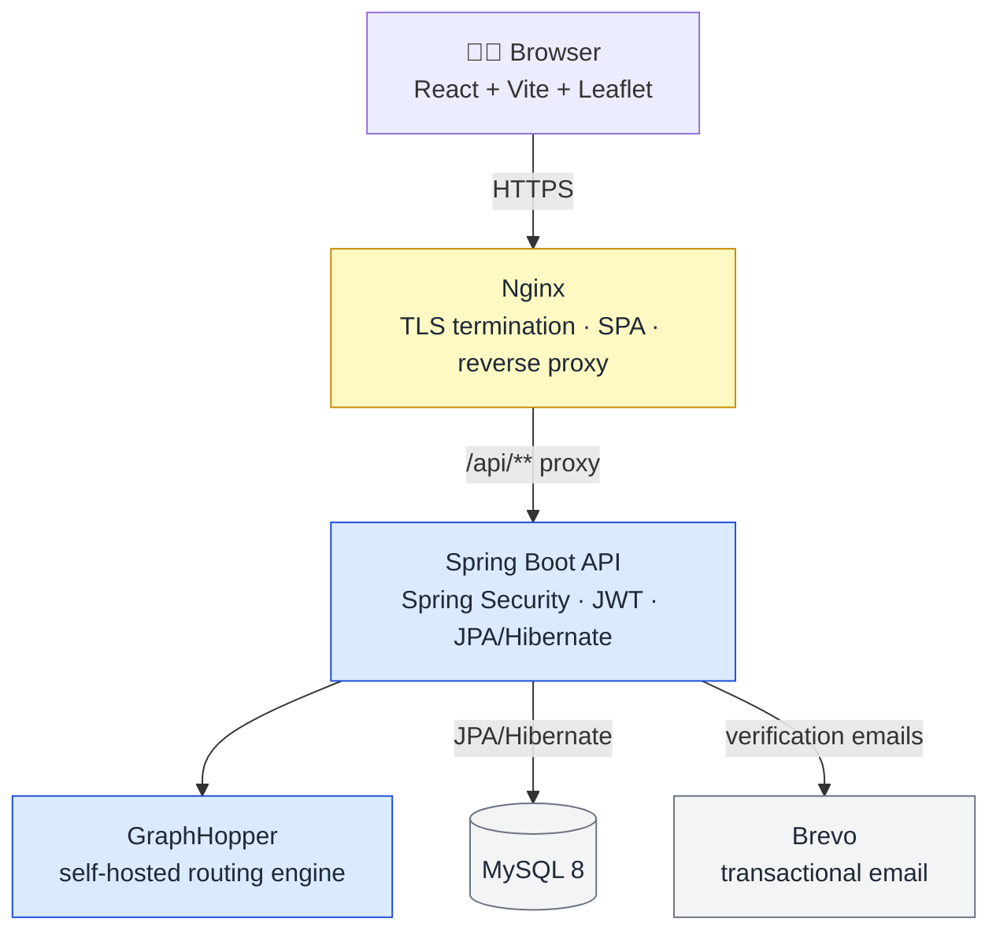

<div align="center">

# 🛣️ RoadReport

### Community-powered live road hazard reporting & hazard-aware navigation

*Built with Georgia 🇬🇪 in mind — point it at a different map extract and it works anywhere.*

<!-- TODO: drop a screenshot or short demo GIF of the map in action right here -->


**[🌐 Live Demo](https://final-project-chipolino.vercel.app/)** &nbsp;·&nbsp; **[🚀 Getting Started](#-getting-started)** &nbsp;·&nbsp; **[📡 API Overview](#-api-overview)**

<sub>Preview deployment of the current feature branch — Aiven + Render + Vercel. See <a href="#-cloud-deployment">Cloud Deployment</a>.</sub>

</div>

---

<details>
<summary>📋 <b>Table of Contents</b></summary>

- [About](#about)
- [Features](#-features)
- [Tech Stack](#-tech-stack)
- [Architecture](#-architecture)
- [Project Structure](#-project-structure)
- [Getting Started](#-getting-started)
- [Testing](#-testing)
- [Cloud Deployment](#-cloud-deployment)
- [API Overview](#-api-overview)
- [Security Notes](#-security-notes)
- [Automated Jobs & Moderation Rules](#-automated-jobs--moderation-rules)
- [Team](#-team)

</details>

---

## About

RoadReport is a full-stack web app where drivers report live road hazards on an interactive map, the community moderates those reports through voting, and a self-hosted routing engine automatically steers new routes around active danger zones.

It has grown to include email-verified accounts, an admin moderation panel, automatic report merging/expiry/promotion, a user reputation system, and hazard-aware routing calculated by a self-hosted engine.

The default map view is centered on Tbilisi and the app currently ships with an OpenStreetMap extract for Georgia, but nothing about the code is Georgia-specific beyond that one data file — point it at a different `.osm.pbf` extract and it works anywhere.

## ✨ Features

### 🗺️ Map & Navigation
- Interactive Leaflet map with **7 report types**, each with its own marker: 🕳️ Pothole · 💥 Accident · 🚗 Heavy Traffic · 🚧 Road Closure · 📸 Speed Camera · 🚓 Police · ⚠️ Custom
- Two modes: **Report mode** (tap the map to file a report at that spot) and **Route mode** (pick an origin & destination)
- **Hazard-aware routing** via a self-hosted GraphHopper engine: routes are penalized around active potholes/accidents/heavy-traffic/closures (closures are avoided outright), scaled by how credible and how "heavy" the report is; speed camera and police reports are shown on the map but don't alter the calculated route
- Search reports within a radius, or switch to "My Reports"
- **Follow-me mode**: keep the map centered on your live GPS location as you move
- Per-device proximity radius preference

### 🗳️ Community & Moderation
- Upvote / downvote any report, with optimistic UI updates
- Reports are automatically **removed** once they collect enough negative votes, or promoted to a **permanent**, non-expiring status once they collect enough confirming votes
- A scheduled job periodically finds duplicate reports of the same type near each other and **merges** them (combining votes, comments and weight)
- Another scheduled job **purges** expired/removed reports from the database
- Comments on every report (create / edit / delete), sanitized server-side against XSS
- A reputation score per user, with "Driver Status" ranks, and **automatic temporary bans** for repeatedly-rejected reporters

### 🔐 Accounts & Security
- JWT auth over a secure, HttpOnly cookie (Spring Security + BCrypt)
- Email verification on sign-up (Brevo transactional email)
- Role-based access control (`USER` / `ADMIN`)
- A dedicated **Admin Panel**: ban/unban/delete users, adjust reputation, force a report's status, delete reports/comments
- **"Admin Shield"** — moderation actions can never be applied to another admin account
- Deleting your account reassigns your reports/comments to an internal "ghost" user, so history isn't lost

## 🧰 Tech Stack

| Layer | Technologies |
|---|---|
| Backend | Java 17 · Spring Boot · Spring Security · Spring Data JPA / Hibernate · MySQL 8 · Lombok · Jsoup (XSS sanitization) · GraphHopper (self-hosted routing) · JUnit 5 · Mockito · Maven |
| Frontend | React · React Router · Leaflet / react-leaflet · Axios · Vite |
| Infra | Docker & Docker Compose · Nginx · Aiven (MySQL) · Render (backend) · Vercel (frontend) · Brevo (email) |

> [!NOTE]
> The JWT cookie is issued with `Secure` + `SameSite=None` (needed since the deployed frontend and backend live on different domains), so browsers will only send/accept it over HTTPS — which is why even local development runs behind a TLS certificate instead of plain HTTP.

## 🏗️ Architecture



Three Docker Compose services do the work: `db` (MySQL, internal-only), `backend` (Spring Boot with the embedded GraphHopper engine — shown in blue above), and `frontend` (Nginx, serving the built SPA and terminating TLS — shown in yellow). In local dev, `backend` is also reachable directly at `localhost:8082` for debugging — but in production, only `frontend` needs to be public; Nginx proxies `/api` requests straight through.

## 📁 Project Structure

```
.
├── docker-compose.yml
├── .env                     # you create this — see Getting Started
├── .env.example
├── server/                  # Spring Boot backend
│   ├── src/
│   │   ├── main/java/RoadReport/...
│   │   ├── main/resources/application.properties
│   │   └── test/java/RoadReport/...      # JUnit test suite — see Testing
│   ├── data/                # OSM extract + GraphHopper cache (not committed)
│   ├── dummy-cache/         # lightweight GraphHopper cache used by tests
│   └── Dockerfile
└── web/                     # React frontend
    ├── src/...
    ├── vite.config.js       # dev-mode HTTPS + /api proxy
    ├── nginx.conf
    ├── vercel.json
    ├── localhost.pem / localhost-key.pem   # you create these — see Getting Started
    └── Dockerfile
```

## 🚀 Getting Started

The fastest path is Docker Compose, which builds and wires up the database, backend, and frontend (with HTTPS) in one command.

### Prerequisites
- Docker Engine + Docker Compose v2 (`docker compose`)
- [mkcert](https://github.com/FiloSottile/mkcert) (or `openssl`) to generate a local TLS certificate
- *(only if running things outside Docker)* Node.js 20+, Java 17+, Maven, MySQL 8

### 1. Clone the repository
```bash
git clone <repo-url>
cd <repo-folder>
```

### 2. Get an OpenStreetMap extract for routing
GraphHopper needs a `.osm.pbf` file to build its road graph. Download an extract covering Georgia (e.g. from [Geofabrik](https://download.geofabrik.de/)) and place it at:
```
server/data/georgia-260525.osm.pbf
```

> [!TIP]
> Using a different file name or region? Either update `graphhopper.osm-file` in `application.properties`, or just set the `OSM_FILE_PATH` environment variable — it overrides the default without touching any code. The **first** backend startup will take a few minutes while GraphHopper imports the file and builds its cache — later starts are fast as long as the container isn't rebuilt/recreated.

### 3. Configure environment variables
Copy the example file into a `.env` at the project root (next to `docker-compose.yml`), then fill it in:
```bash
cp server/.env.example .env
```

| Variable | Description | Example |
|---|---|---|
| `SPRING_DATASOURCE_URL` | JDBC URL for MySQL | `jdbc:mysql://db:3306/roadreport` |
| `DB_USERNAME` | MySQL username | `root` |
| `DB_PASSWORD` | MySQL password | must match `MYSQL_ROOT_PASSWORD` in `docker-compose.yml` |
| `JWT_SECRET_KEY` | Base64-encoded HMAC signing key | generate with `openssl rand -base64 32` |
| `JWT_EXPIRATION` | Token lifetime, in **milliseconds** | `86400000` (24h) |
| `FRONTEND_URL` | Public URL of the frontend, used inside verification emails | `https://localhost` |
| `BREVO_API_KEY` | API key for Brevo transactional email | — |
| `SENDER_EMAIL` | Verified "from" address for verification emails | `no-reply@roadreport.ge` |
| `OSM_FILE_PATH` | *(optional)* Overrides where GraphHopper looks for the `.osm.pbf` extract | defaults to `data/georgia-260525.osm.pbf` |

> [!NOTE]
> The bundled `docker-compose.yml` hardcodes the MySQL root password (`chipolino123`) and database name (`roadreport`) for the `db` service — keep `DB_USERNAME` / `DB_PASSWORD` / `SPRING_DATASOURCE_URL` in sync with those, or edit `docker-compose.yml` if you want different credentials. No manual migrations needed — Hibernate creates the schema automatically (`ddl-auto=update`) against the empty database on first boot.

> [!WARNING]
> No real Brevo key yet? Registration still "succeeds", but the verification email silently fails to send and the new account stays disabled. Either add real Brevo credentials, or manually set that user's `is_enabled` column to `1`/`TRUE` in the `users` table for local testing.

### 4. Generate a local TLS certificate
The frontend container serves the app over HTTPS using a certificate you provide. Generate one for `localhost` and place it in `web/`:
```bash
mkcert -install
mkcert -cert-file web/localhost.pem -key-file web/localhost-key.pem localhost
```

> [!WARNING]
> Without these two files, the `frontend` image won't build — the Dockerfile copies them in directly. (The same two files are also picked up automatically if you run the frontend outside Docker — see below.)

### 5. Run it
```bash
docker compose up --build
```

| Service | Purpose | Exposed as |
|---|---|---|
| `db` | MySQL 8 | internal only |
| `backend` | Spring Boot API + GraphHopper | `localhost:8082` (direct/debug access) |
| `frontend` | Nginx: serves the SPA, proxies `/api` to the backend, terminates TLS | `https://localhost` |

Open **https://localhost** (accept the self-signed certificate warning if you skipped `mkcert -install`).

> [!IMPORTANT]
> **First login:** the backend seeds a default admin on first boot — `road_admin` / `road_admin` (see `SystemDataInitializer`). **Change or remove it before deploying anywhere public.** A second internal account, `ghostUser`, is also created to hold content from deleted users and has no usable password.

> [!TIP]
> The GraphHopper cache isn't mounted as a Docker volume, so `--build` or `down && up` re-imports the OSM graph from scratch. Mount `server/data/graphhopper-cache` as a volume if you want faster rebuild cycles.

### Running locally without Docker

**Database** — install MySQL 8 and create an empty database:
```sql
CREATE DATABASE roadreport;
```
Hibernate creates all the tables automatically on first run (`ddl-auto=update`), so no manual migration is required. If you'd rather set the schema up explicitly, a plain SQL version (matching what Hibernate would generate) is also included in the repo — note that it targets a database named `road_report_db`, so either rename it to match your `SPRING_DATASOURCE_URL` or point the URL at that name instead.

**Backend:**
```bash
cd server
# export the variables from your .env into the shell, or configure them in your IDE run config
./mvnw spring-boot:run
```
Runs at `http://localhost:8080`. You need to set `OSM_FILE_PATH` if your `.osm.pbf` file lives somewhere other than `app/data/georgia-260525.osm.pbf` — that's the default.

**Frontend:**
```bash
cd web
npm install
npm run dev
```
Runs at `http://localhost:5173`. `vite.config.js` already proxies `/api` to `http://localhost:8080`, so the dev server talks to your local backend with no extra setup. If `web/localhost.pem` / `web/localhost-key.pem` exist (the same certificate pair from step 4 above), Vite automatically serves over HTTPS too — otherwise it just falls back to plain HTTP.

## 🧪 Testing

The backend has a JUnit 5 test suite under `server/src/test/java/RoadReport/`, mirroring the main source layout:

| Package | Covers |
|---|---|
| `TestControllers` | REST endpoint behavior |
| `TestExceptionHandler` | Global exception → HTTP status mapping |
| `TestRepositories` | JPA queries, via `@DataJpaTest` + `TestEntityManager` |
| `TestSecurity` | JWT filter & authentication flow |
| `TestServices` | Business logic — reports, votes, users, email, etc. |

Repository tests spin up an isolated JPA context and exercise the real queries — e.g. `TestCommentRepository` covers per-report/per-user ordering and the comment-migration query used when reports get merged. Service-layer tests lean on Mockito — `TestEmailService`, for example, mocks `RestClient` to confirm both the happy path and that a failed Brevo call is caught and logged instead of breaking registration.

Run everything with:
```bash
cd server
./mvnw test
```

> [!NOTE]
> A `dummy-cache` folder alongside `src/` gives GraphHopper a small, isolated cache to boot from during tests, so the suite doesn't need to import the full real-world OSM extract just to start the Spring context.

## ☁️ Cloud Deployment

The live demo runs on a three-provider setup:

| Layer | Provider |
|---|---|
| Database | [Aiven](https://aiven.io/) (managed MySQL) |
| Backend API | [Render](https://render.com/) (Docker deploy of `server/`) |
| Frontend | [Vercel](https://vercel.com/) (static build of `web/`) |

To deploy your own copy:
1. Spin up a MySQL database on Aiven and grab its connection details.
2. Deploy `server/` as a Docker web service on Render, setting the same environment variables from the table above (pointed at your Aiven database).
3. Deploy `web/` on Vercel, updating the `destination` in `vercel.json` to your Render backend's URL.
4. Set `FRONTEND_URL` (backend env var) to your Vercel domain, so verification emails link to the right place.
5. Confirm your Vercel domain is covered by the CORS allow-list in `SecurityConfig.java` (`*.vercel.app` is allowed by default).

## 📡 API Overview

All endpoints are prefixed with `/api`. 🌐 = public, ✅ = requires a logged-in user (JWT cookie or `Authorization: Bearer` header).

**Auth** (`/auth`)
| Method | Path | Auth | Description |
|---|---|---|---|
| POST | `/register` | 🌐 | Create an account (sends a verification email) |
| POST | `/login` | 🌐 | Authenticate, sets the JWT cookie |
| POST | `/logout` | 🌐 | Clears the JWT cookie |
| GET | `/verify?token=` | 🌐 | Confirm an email verification token |

**Users** (`/users`)
| Method | Path | Auth | Description |
|---|---|---|---|
| GET | `/me` | ✅ | Current user's private profile |
| GET | `/{id}` | ✅ | Another user's public profile |
| PUT | `/me` | ✅ | Update the current user's profile |
| DELETE | `/me` | ✅ | Delete the current user's account |

**Reports** (`/reports`)
| Method | Path | Auth | Description |
|---|---|---|---|
| POST | `/` | ✅ | Submit a report at a location |
| GET | `/?latitude=&longitude=&radius=` | 🌐 | Reports within a radius (`radius<=0` → all reports) |
| GET | `/me` | ✅ | Reports submitted by the current user |

**Votes** (`/vote`)
| Method | Path | Auth | Description |
|---|---|---|---|
| POST | `/{reportId}/upvote` | ✅ | Upvote a report |
| POST | `/{reportId}/downvote` | ✅ | Downvote a report |
| GET | `/{reportId}/votes` | 🌐 | Current up/down vote counts |

**Comments**
| Method | Path | Auth | Description |
|---|---|---|---|
| POST | `/reports/{reportId}/comments` | ✅ | Add a comment |
| GET | `/reports/{reportId}/comments` | 🌐 | List comments on a report |
| PUT | `/comments/{commentId}` | ✅ | Edit your own comment |
| DELETE | `/comments/{commentId}` | ✅ | Delete your own comment |

**Routes** (`/routes`)
| Method | Path | Auth | Description |
|---|---|---|---|
| POST | `/calculate` | ✅ | Compute a hazard-aware route through a list of waypoints |

**Admin** (`/admin`, requires `ROLE_ADMIN`)
| Method | Path | Description |
|---|---|---|
| GET | `/users/{id}` | Full account details for a user |
| PATCH | `/users/{id}/ban?daysToBan=` | Ban a user for N days |
| PATCH | `/users/{id}/unban` | Lift a ban |
| DELETE | `/users/{id}` | Delete a user (content reassigned to the ghost user) |
| PATCH | `/users/{id}/reputation?isReset=&score=` | Adjust or reset reputation |
| PATCH | `/reports/{id}/status?newReportStatus=` | Force a report's status |
| DELETE | `/reports/{id}` | Delete a report |
| DELETE | `/comments/{id}` | Delete a comment |

All admin actions are blocked against other `ADMIN` accounts (the "Admin Shield").

> [!NOTE]
> Per the current `SecurityConfig`, only `/auth/**`, `GET /reports/**`, and `GET /vote/*/votes` are open to anonymous requests — everything else (including viewing another user's profile) currently needs a session. Adjust `SecurityConfig.java` if public profile pages are meant to work for logged-out visitors too.

## 🔒 Security Notes
- Passwords hashed with BCrypt
- JWT stored in a `Secure`, `HttpOnly`, `SameSite=None` cookie (also accepted via `Authorization: Bearer`)
- Comment and report-description input is sanitized server-side with Jsoup before it's stored
- Endpoint-level RBAC via Spring Security + `@PreAuthorize`
- "Admin Shield": moderation actions are rejected outright if the target is also an `ADMIN`
- Optimistic locking (`@Version`) guards `User` and `Report` against concurrent-update conflicts

## ⚙️ Automated Jobs & Moderation Rules

| Job | Frequency | What it does |
|---|---|---|
| Report cleanup | every 2 minutes | Deletes reports that are expired or already `REMOVED` |
| Duplicate merge | every hour | Merges active reports of the same type within ~50m of each other (votes, comments, and weight combined) |

| Rule | Condition | Effect |
|---|---|---|
| Auto-remove | ≥ 5 total votes, ≥ 50% downvotes | Status → `REMOVED`; author loses reputation |
| Auto-promote to permanent* | ≥ 10 total votes, ≥ 95% upvotes | Status → `PERMANENT` (stops expiring) |
| Reject-streak ban | 3 auto-removed reports | Author banned for 3 days |
| Rejected-report penalty | A report is auto-removed | Author reputation −5 |
| Per-vote reputation | Each up/downvote received on a report | Author reputation +1 / −1 |
| Default report lifetime | — | 1 day from creation, unless promoted to `PERMANENT` |

\* Only for non-ephemeral types: `POTHOLE`, `SPEED_CAMERA`, `POLICE`. `ACCIDENT`, `HEAVY_TRAFFIC`, `ROAD_CLOSURE`, and `CUSTOM` are always temporary and simply expire.

## 👥 Team

Built by a five-person team as a Freeuni OOP final project:

- Giorgi Ezugbaia
- Luka Tasoshvili
- Nikoloz Bendianishvili
- Luka Tsitsilashvili
- Nikoloz Shubitidze

<div align="center">

<br>

⭐ **If RoadReport is useful to you, consider starring the repo!**

</div>
